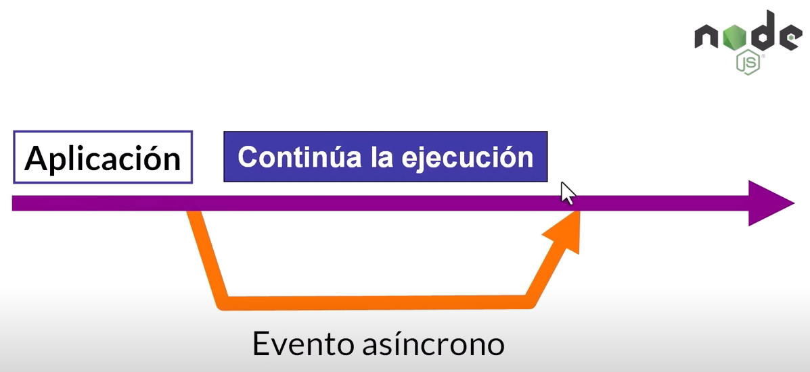
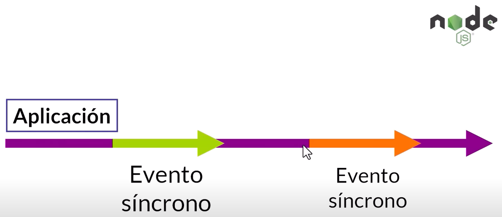
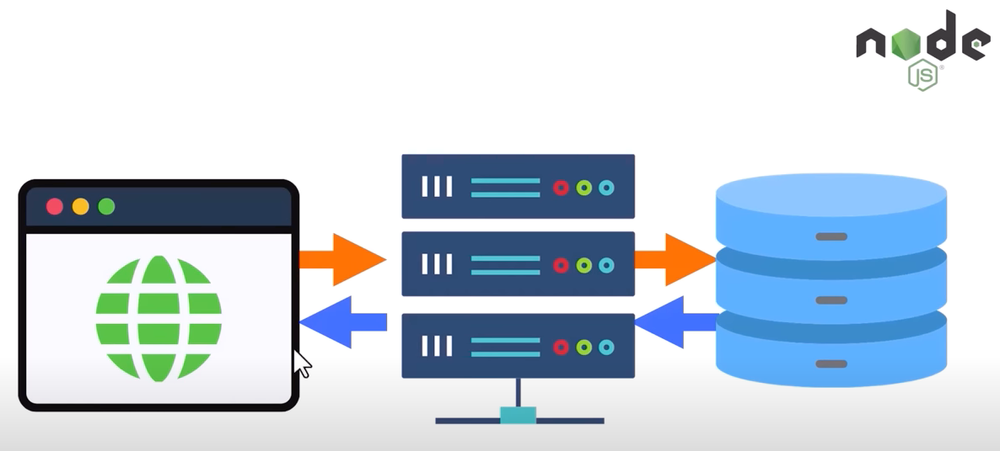
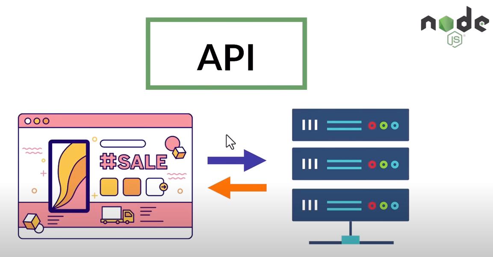
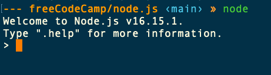
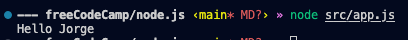
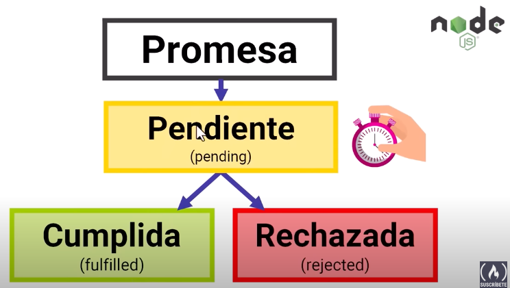
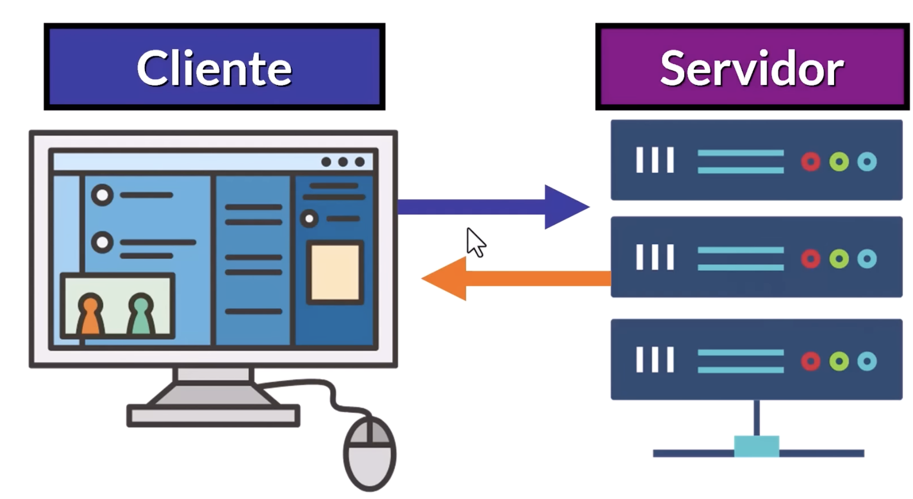

# Node.js

## 1. Introducción a Node.js

- **Qué no es Node.js**
  No es un lenguaje de porgramación
  No es un framework de JS
  No es una librearía de JS
- **Que es Node?**
  Node es un **entorno de ejecución** de JavaScript orientado a **eventos asincronos** de manera local (En la terminal).
- **Qué es un entorno de ejecución**
  Un entorno de ejecución es un entorno o infraestructura en el cual se ejecuta un porgrama o aplicación.
- **Qué es un evento asíncrono**
  Un evento asíncrono es aquella acción o evento que se ejecuta independientemente del proceso principal de la aplicación.
  No interrumpe la ejecución de la aplicación, a diferencia de un evento sincrono.
  
- **Qué es un evento sincrono?**
  Es un evento que se ejecuta como parte del proceso principal de la aplicación.
  Si interrumpe la ejecución de la aplicación, adiferenciua de un evento asíncrono.
  

## 2. Conceptos Básicos

- **Arquitectura Cliente-Servidor**
  Módelo en el cual el **servidor** envía recursos al dispotivio que los solicita **(Cliente)**

- **Qué es un Protocolo**
  Un protocolo es un conjunto de reglas que permite que dos o más entidades de una red se comuniquen entre sí.

- **Qué es una Base de Datos?**
  Una base de datos es un conjunto de datos estructurados sobre un mismo contexto que se pueden consultar.



## 3. Aplicaciónes de Node.js

Node es usado para desarrollo Back-End y creación de API's

- **Qué es una API**
  Una API por sus siglas en ingles significa:
- **A**pplicacion
- **P**rogramming
- **I**nterface
  En español una Interfaz de progra,mación de aplicaciónes.
  

- **Porque usar Node.js**
  Porque nos permite desarollar aplicaciones escalabres y de tiempo real.
- **Qué significa que una aplicación sea Escalable**
  Qué su **rendimiento** se puede adaptar a menida que crece el uso de la aplicación y recibe más solicitudes
- **Qué significa que unaaplicación sea de Tiempo Real**
  Qué establece una relación bidireccional y dínamica entre el servidor y el cliente. Analiza los eventos que occuren y reacciona de forma casi inmediata.

## 4. El REPL de Node.js

- **Qué significa REPL**
  REPL singifica
- Read
- Eval
- Print
- Loop
  En español sería, el Ciclo de Leer, Evaluar y Mostrar
  Para ingresar en el REPL, lo hacemos escribiendo en la terminal el comando `node`.

  

## 5. Primer programa con Node.js

Para ejecutar con Node.js un archivo de JS localmente lo hacemos desde la termina con la palabra reservada node, de la siguiente forma: `node path/fileName.js`

Por ejemplo, tenemos un archivo llamado app.js con una función que saluda

```js
function saludar(nombre) {
  return `Hello ${nombre}`;
}

console.log(saludar("Jorge"));
```

En la termina escribimos:

```
node src/app.js
```



## 6. Modulos de Node.js

- **Qué es un módulo de node.js**
  Un módulo es una funcionalidad organizada en uno o varios archivos JavaScript que puede ser **reutilizada** en una aplicación.

- **Ventajas de trabajar con módulos**
- Evitamos repetir código
- Reutilizamos el código
- Es más fácil encontrar y corregir bugs
- Es más fácil modificar el código
- Es más fácil agregar nueva funcionalidades

## 7. Módulos principales de Node.js

Los módulos buit-in o módulos core son los módulos principales que viene instalados en Node.js, es decir, se pueden usar directamente al trabaajr con Node.js, sin instalarlos.
Son muy utiles para realizar tareas comunes al trabajar con Node.js.

- http
- https
- fs (file system)
- os (operating system)
- path

### 7.1 El módule console

Console es un módulo buit-in que implemnta la funcionalidad similar a la consola de un navegador web.

- **console.log()**
- **console.warm()**
- **console.error()**
- **console.assert()**
- **console.table()**

### 7.2 El módulo process

- **console.log(process)**

### 7.3 El módulo OS

- **const os = require("os");**

Este módulo nos permite obtener información sobre el sistema operativa donde se esta ejecutando la aplicación.

Ejemplos:

```js
console.log(os.type());
console.log(os.homedir());
console.log(os.uptime());
console.log(os.userInfo());
```

### 7.4 El módulo Timers

El módulo Timers contiene funciones que ejecutan un código despues de cierto periodo de tiempo. Ayuda a simular eventos asíncronos.
Tres funciones muy utiles son:

- **setTimeout();**
  Sirve para ejecutar un código luego de un úmero especifico de milisegundos.
  1 segundo = 1000 milisegundos.

  ```js
  setTimeout(función a ejecutar, retraso, argumento1, argument2 );
  ```

  Ejemplo:

  ```js
  function showTheme(theme) {
    console.log(`I'm learning ${theme}`);
  }

  setTimeout(showTheme, 3000, "Node.js");

  function add(a, b) {
    console.log(a + b);
  }

  setTimeout(add, 3000, 2, 3);
  ```

- **setImmediate();**
  Sirve para ejecutar código asíncrono en la próxima iteración del ciclo de eventos (Lo más pronto posible).
  La función se va a ejecutar después del código síncrono.

  ```js
  setImmidiate(función a ejecutar, argumento1, argument2 );
  ```

  Ejemplo:

  ```js
  function showTheme(theme) {
    console.log(`I'm learning ${theme}`);
  }

  console.log("Before setImmediate");
  setImmediate(showTheme, "Node.js");
  setTimeout(showTheme, 3000, "Express.js");
  console.log("After setImmediate");
  ```

- **setInterval();**
  Sirve para ejecutar código un número infinito de veces con un retraso específico de milisegundos.

  ```js
  setInterval(function, intervalo, arg1, arg2)
  ```

  ```js
  function showTheme(theme) {
    console.log(`I'm learning ${theme}`);
  }

  console.log("Before setImmediate");
  setImmediate(showTheme, "Node.js");
  setTimeout(showTheme, 3000, "Express.js");
  setInterval(showTheme, 5000, "GO");
  console.log("After setImmediate");
  ```

### 7.5 El módulo fs (file system)

Este módulo contiene funcionalida muy util para trabjar con sistemas de archivos.
Operaciones utiles que podemos realizar con este módulo, tenemos:

- leer

```js
const fs = require("fs");

fs.readFileSync("index.html", "utf-8", (error, content) => {
  if (error) {
    console.log(error);
  } else {
    console.log(content);
  }
});
```

- Modificar

```js
// Añadir contendio al final
fs.appendFile("index.html", "<p>Hello by Append</p>", (err) => {
  if (err) {
    throw err;
  }
  console.log("File updated successful");
});
```

```js
// Remplazar todo el contendio por nuevo
fs.writeFile("index.html", "<p>Hello by Append</p>", (err) => {
  if (err) {
    throw err;
  }
  console.log("File replaced successful");
});
```

- Copiar
- Eliminar

```js
const fs = require("fs");

fs.unlink("main.html", (err) => {
  if (err) {
    throw err;
  }
  console.log("File deleted successful");
});
```

- Cambiar nombre

```js
const fs = require("fs");

fs.rename("index.html", "main.html", (error) => {
  if (error) {
    throw error;
  }
  console.log("Rename file successful");
});
```

Todos los métodos de este módulo son asíncronos por defecto.
Para volver ún m+etodo síncrono, le agregamos la palabra **sync**

```js
fs.rename();
fs.renameSync();
```

# 8. Introducción a NPM

- **Qué es NPM?**
  Significa Node Package Module.
  Es el archivo de software más grande del mundo que contiene **paquetes** puedes instalar y usar con Node.js
- **Qué es un Paquete?**
  Un paquete es un archivo o directorio descrito por un archivo de pasckage.json
  El paquete puede ser publicado en el registor de npm.
- **Qué es un Módulo?**
  Un módulo es cualquier archivo o directorio en el directorio **node_modules** que puede ser impoirtadom con cualquier **require()**
  Solo los módulos que tiene un archivos package.json son paquetes.
- **Qué es una dependencia?**
  Una dependencia es un paquete que otro paquete necesita para funcionar correctamente.

## 8.2 Intro a JSON

- **Qué es JSON?**
  JSON = JavaScript Object Notation
  JSON es un formato de texto usado para almacenar y transportar información.

Para convertir **JSON a JS** usamos **JSON.parse()** y para convertir de **JS a JSON** usamos **JSON.stringiy()**

# 4. Eventos y JavaScipt asíncrono

## 4.1 Eventos en Node.js

- **Qué es un evento?**
  Un evento es una acción que se realiza en la aplicación.
  Tmabien podemos definir eventos que se desencadenan y ejecutan internamente en el servidor.
- **Qué es un Emitter(Emizor)**
  Un emitter es un **Objeto** que **emite eventos** nombrados y llaman a funciones especificas cuando ocurren.
  Los **Emitters** son instancias de la clase **EventEmitter**
  Tienen un método **.on()** para asociar una función al evento, esa función se ejecuta cuando ocurre el evento. Dichas funciones se conocen como **Event listener** o **Event handler**

## 4.2 Módulo events

El módulo events nos permite:

- Definir para poder decir que va a ocurrir cuando el evento ocurra.
- Emitir para crear esos eventos
- Escuchar para saber cuando ocurren

```js
const EventEmitter = require("events");

const emisorProductos = new EventEmitter();

emisorProductos.on("compra", (total) => {
  console.log("Se realizo una compra por: $" + total);
});

emisorProductos.emit("compra", 500);

// --- freeCodeCamp/node.js ‹main* M?› » node app.js
// Se realizo una compra por: $500
```

## 4.3 Promesas en JavaScript

- **Qué es una Promesa?**
  Una promesa es un Objeto de JS que representa el eventual resultado o error de una operación asíncrona.
  Una promesa tiene 3 estados posibles:
  
  Ese objeto de la promesa se asocia a una **Callback function** o funcion de respuesta.

- **Qué es una función callback?**
  Una función callback es una función que se pasa a otra función como argumento y luego se ejecuta dentro de la función externa.

Las promesas tiene un método **.then()** con el cual podemos decidir qué ocurre cuando se completa la promesa de manera éxitosa o errada.

## 4.4 Práctica de promesas

```js
const promiseCompleted = true;

const miPromise = new Promise((resolve, reject) => {
  if (promiseCompleted) {
    resolve("Promise successful");
  } else {
    reject("Promise failed...");
  }
});

const handleSuccessPromise = (value) => {
  console.log(value);
};

const handleRejectPromise = (errorReason) => {
  console.log(errorReason);
};

miPromise.then(handleSuccessPromise, handleRejectPromise);
```

Ejemplo ordenes de pizzas:

```js
// Pizzas example

const statusDelivery = () => {
  const status = Math.random() < 0.5;
  console.log(status);
  return status;
};

const myPizzaDelivery = new Promise((resolve, reject) => {
  if (statusDelivery) {
    resolve("Su pedido ha sido exitoso, ya se esta preparando la pizza!");
  } else {
    reject("Ha ocurrido un error, por favor vuelva a intentar.");
  }
});

myPizzaDelivery
  .then((confirmationMessage) => {
    console.log(confirmationMessage);
  })
  .then(null, (errorMessage) => {
    console.log(errorMessage);
  });
```

## 4.5 .catch()

```js
// Pizzas example

const statusDelivery = () => {
  return Math.random() > 0.05;
};

const myPizzaDelivery = new Promise((resolve, reject) => {
  if (statusDelivery) {
    resolve("Su pedido ha sido exitoso, ya se esta preparando la pizza!");
  } else {
    reject("Ha ocurrido un error, por favor vuelva a intentar.");
  }
});

const handleSuccess = (confirmationMessage) => {
  console.log(confirmationMessage);
};

const handleError = (errorMessage) => {
  console.log(errorMessage);
};

myPizzaDelivery.then(handleSuccess).catch(handleError);
```

## 4.6 Encadenar promesas y Async y Await

```js
function ordenarPedido(producto) {
  return new Promise((resolve, reject) => {
    console.log(`Ordenando: ${producto} de FreeCodeCamp`);
    setTimeout(() => {
      if (producto === "taza") {
        resolve("Ordenando una taza de FreeCodeCamp");
      } else {
        reject("Taza de FreeCodeCamp no disponible");
      }
    }, 2000);
  });
}

function procesarPedido(respuesta) {
  return new Promise((resolve, reject) => {
    console.log("Procesando respuesta...");
    console.log(`La respuesta fue: "${respuesta}"`);
    setTimeout(() => {
      resolve("Gracias por tu compra. Disfruta tu producto de FreeCodeCamp");
    }, 4000);
  });
}
// Promises Chaining ================================
ordenarPedido("taza")
  .then((respuesta) => {
    console.log("Respuesta recibida");
    return procesarPedido(respuesta);
  })
  .then((respuestaProcesada) => {
    console.log(respuestaProcesada);
  })
  .catch((err) => {
    console.log(err);
  });

// Async Await ======================================
async function realizarPedido(producto) {
  try {
    const respuesta = await ordenarPedido(producto);
    console.log("Respuesta recivida");
    const respuestaProcesada = await procesarPedido(respuesta);
    console.log(respuestaProcesada);
  } catch (error) {
    console.log(error);
  }
}
```

# 5 HTTP y rutas en Node.js

## 5.1 Modelo cliente-servidor

- **Qué es el módelo CLiente-Servidor?**
  El Módelo Cliente-Servidor es un Módelo que usamos para acceder a internet y obtener los recursos e información.
  
- **Qué es el Cliente?**
  Un Cliente es el navegador desde el cual se realizan solicitudes a un servidor
- **Qué es el Servidor?**
  Un Servidor es un porgrama que se ejecuta en un servidor físico para ofrecer un servicio al cliente. Envia informaicón.

El protocolo HTTP define el formato de los mensajes enviados entre el Cliente y el Servidor.
HTTP significa por sus siglas en ingles **H**yper**T**ext **T**ransfer **P**rotocol.
En español Protocolo de transferencia de hipertexto.

- **Qué es un Protocolo?**
  Un portocolo es un conjunto de reglas que permiten transmitir información entre dispositivos de una red.

## 5.2 Solicitudes HTTP

Una **solicitud HPPT / HTTP request** esta conformada por los siguientes elementos:

- Métodos HTTP
- Camino (Path)
- Versión de HTTP
- Cabeceras (Headers): Proveen información adicional sobre la solicitud.
- Cuerpo (Body): Contiene la información que debe ser enviar al servidor para procesar la solicitud. No se incluye en todas la solicitudes. Solo en aquellas que requieran enviar información, por ejemplo: POST, PUT

## 5.3 Métodos HTTP

Un método HTTP es un verbo o sustantivo que indica la intención de la solicitud.

- **GET:** es un verbo usado para **solicitar** un recurso especifico.
- **POST:** es un verbo para **crear** un recurso en especifico.
- **PUT:** es un verbo para **modificar** un recurso en especifico.
- **DELETE:** es un verbo para **eliminar** un recurso en especifico.

## 5.4 Respuestas HTTP

Las respuestas HHTP tiene la siguiente estructura:

- Código de estado
- Texto de estado
- Versión del HTTP
- Cabeceras (Headers): Son opcionales y proveen información adicional sobre la respuesta.
- Cuerpo (Body): Contiene la información que debe ser enviar desde el servidor hacia el cliente.

## 5.5 Códigos de estado HTTP

- [http.cat.status](https://http.cat/)
- [MDN Docs](https://developer.mozilla.org/en-US/docs/Web/HTTP/Status)

## 5.6 Tu primer servidor con Node.js

## 5.7 req y res

## 5.8 Estructura de una URL

## 5.9 El módulo url

## 5.10 Routing en Node.js
